# 📁 智能文件夹代码合并工具

<div align="center">


**一个强大的在线工具，可以将整个项目文件夹的代码合并到一个格式化的 Markdown 文档中**

[🌐 在线使用](https://weiruchenai1.github.io/code-merger-tool) • [📖 使用文档](#使用说明) • [🤝 贡献代码](#贡献) • [📄 许可证](#许可证)

</div>

---

## ✨ 功能特点

<table>
<tr>
<td width="50%">

### 🚀 核心功能
- **拖拽上传**：支持拖拽整个文件夹，自动遍历所有子目录
- **可视化文件树**：直观的树形结构显示所有文件和文件夹
- **灵活选择**：点击文件夹可排除/包含整个目录，点击文件可单独控制
- **智能过滤**：自动排除无关文件（node_modules、.git等）

</td>
<td width="50%">

### 🎨 用户体验
- **实时统计**：显示文件数量、大小等统计信息
- **语法高亮**：自动识别文件类型并添加相应的代码块语法
- **响应式设计**：完美支持桌面和移动设备
- **隐私安全**：所有处理都在浏览器本地完成

</td>
</tr>
</table>

## 🚀 快速开始

### 在线使用
直接访问：**[https://weiruchenai1.github.io/code-merger-tool](https://weiruchenai1.github.io/code-merger-tool)**

### 本地部署
```bash
# 克隆仓库
git clone https://github.com/weiruchenai1/code-merger-tool.git
cd code-merger-tool

# 直接打开 index.html 即可使用（无需任何依赖）
```

## 📖 使用说明

### 🎯 基本操作流程

```mermaid
graph LR
    A[📂 上传项目文件夹] --> B[🏷️ 设置项目名称]
    B --> C[🎯 选择需要的文件]
    C --> D[📝 生成代码文档]
    D --> E[💾 下载 Markdown]
```



### 📋 详细步骤

| 步骤 | 操作 | 说明 |
|:---:|:---|:---|
| 1️⃣ | **上传项目** | 拖拽或选择整个项目文件夹到上传区域 |
| 2️⃣ | **设置名称** | 工具会自动识别项目名称，也可手动修改 |
| 3️⃣ | **选择文件** | 在文件树中点击选择需要包含的文件和文件夹 |
| 4️⃣ | **生成文档** | 点击"生成代码文档"按钮 |
| 5️⃣ | **下载保存** | 下载生成的 Markdown 文件 |

### 🎮 交互技巧

> **文件选择技巧**
> - 🗂️ **点击文件夹**：包含/排除整个文件夹下的所有文件
> - 📄 **点击文件**：单独包含/排除某个文件
> - ✅ **全选**：选择所有文件
> - ❌ **全不选**：取消所有选择
> - 🔄 **重置选择**：恢复到智能默认设置

### 🚫 自动排除的文件类型

<details>
<summary>点击查看完整列表</summary>

- **依赖目录**：`node_modules`、`.git`、`dist`、`build`、`.cache`
- **临时文件**：`*.log`、`*.tmp`、`*.cache`
- **系统文件**：`.DS_Store`、`Thumbs.db`
- **隐藏文件**：以 `.` 开头的文件（可配置）
- **二进制文件**：图片、视频、压缩包等（可配置）

</details>

## 📂 输出格式预览

生成的 Markdown 文档结构如下：

```markdown
# 项目名称 代码文档

生成时间：2024-XX-XX XX:XX:XX
包含文件数量：XX

---

## 📁 项目目录结构
```
项目名称/
├── 📁 src/
│   ├── 📄 index.js
│   └── 📄 utils.js
└── 📄 README.md
```

---

## 📄 项目名称\src\index.js
```javascript
// 文件内容
console.log('Hello World');
```
```

## 🌟 使用场景

<div align="center">

| 场景 | 描述 | 优势 |
|:---:|:---|:---|
| 🔍 **代码审查** | 将整个项目代码整理成文档供他人审查 | 便于集中查看和评论 |
| 📚 **技术分享** | 制作技术教程或代码示例文档 | 格式统一，易于理解 |
| 📦 **项目归档** | 将项目代码保存为可读性强的文档格式 | 长期保存，搜索友好 |
| 🤖 **AI 助手** | 为 ChatGPT、Claude 等准备完整的项目上下文 | 一次性提供完整信息 |
| 💾 **代码备份** | 以文档形式备份重要代码片段 | 可读性强，跨平台 |

</div>

## 🛠️ 技术栈

<div align="center">


</div>

- **纯前端实现**：HTML5 + CSS3 + JavaScript
- **文件处理**：File API + FileReader API
- **拖拽上传**：HTML5 Drag & Drop API
- **零依赖**：不需要任何外部库或框架

## 🤝 贡献

我们欢迎所有形式的贡献！无论是报告 Bug、提出新功能建议，还是提交代码改进。

### 🔧 开发指南

1. **Fork 本仓库**
   ```bash
   git clone https://github.com/yourusername/code-merger-tool.git
   ```

2. **创建特性分支**
   ```bash
   git checkout -b feature/awesome-feature
   ```

3. **提交你的更改**
   ```bash
   git commit -m 'Add some awesome feature'
   ```

4. **推送到分支**
   ```bash
   git push origin feature/awesome-feature
   ```

5. **提交 Pull Request**

### 🐛 报告问题

如果你发现了 Bug 或有改进建议，请[提交 Issue](https://github.com/weiruchenai1/code-merger-tool/issues/new)。

## 📈 项目统计

<div align="center">

### Star 历史

[](https://star-history.com/#weiruchenai1/code-merger-tool&Date)

</div>

## 📄 许可证

本项目采用 [MIT 许可证](LICENSE) 开源。

## 🙏 致谢

感谢所有使用和贡献这个项目的开发者！你们的支持是我们前进的动力。

<div align="center">

### 💝 如果这个工具对你有帮助，请给个 ⭐ Star 支持一下！

**让更多的开发者发现这个有用的工具** 🚀

---

<sub>Built with ❤️ by [weiruchenai1](https://github.com/weiruchenai1)</sub>

</div>
